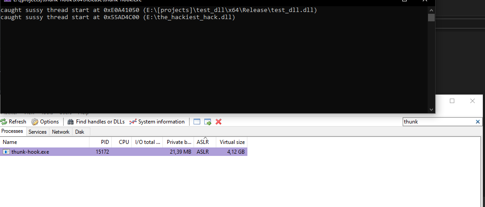
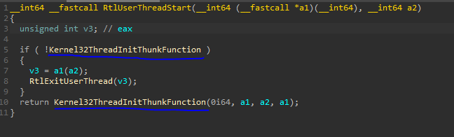

## What does this do?
This project swaps the .data qword "Kernel32ThreadInitThunkFunction" inside ntdll.dll, which can be used to prevent/detect dll injection methods (like LoadLibrary) that create a thread.

## What is BaseThreadinitThunk/Kernel32ThreadInitThunkFunction?
BaseThreadinitThunk is a thread initialization thunk that is called when a thread is started, therefor "Kernel32ThreadInitThunkFunction" is a global qword inside ntdll that holds "BaseThreadinitThunk".
For more information about Kernel32ThreadInitThunkFunction, you can read [this](https://stackoverflow.com/a/49031949)

## Result
After running the compiled solution and attempting to inject a dll with process hacker, this is what im met with:

### Notes:
This will probably not work for many people, since you have to update the address of "Kernel32ThreadInitThunkFunction" [here](https://github.com/ntos322/init-thunk-hook/blob/main/src/hook/hook.cpp#L23).
You can find the address of "Kernel32ThreadInitThunkFunction" by loading up ntdll.dll in ida, locate the exported function "RtlUserThreadStart" and you should see the qword called "Kernel32ThreadInitThunkFunction".

or instead of manually defining the address, you could use something like [this](https://gist.github.com/odzhan/fe278c2588e462edf3a9fd61f3c51d93)

Pseudocode of RtlUserThreadStart:

### Contact me:
discord: ntxor
